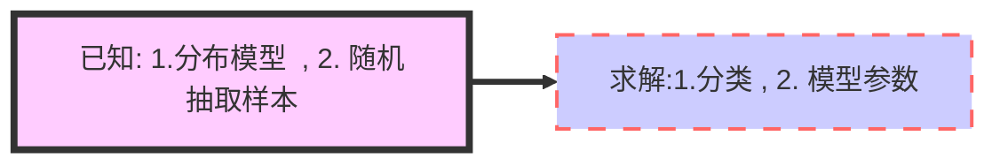

# 第七章 复杂数据密度建模 (1.5)

[TOC]

## 正态分布模型 
    正态分布模型
    隐变量	 
    期望最大化： EM算法
    高斯混合模型
    t分布
    因子分析
    组合模型


## EM算法：
https://www.cnblogs.com/lyrichu/p/7814651.html
+ **凸函数的定义：**
  $$
  f(\lambda {x_1} + (1 - \lambda ){x_2}) \le \lambda f({x_1}) + (1 - \lambda )f({x_2});\forall \lambda  \in (0,1) \tag{3.1}
  $$
  <div align="center">
  </div>
+ **Jeson 不等式：**
  $$ Jeson不等式： E(f(x)) \ge f(E(x)) \tag{3.2}$$  
  用概率方式表达：
  $$
  \sum \limits_{i=1}^{n}p_if(x_i) \ge f(\sum \limits_{i=1}^{n}p_ix_i) , \; \; 其中\sum \limits_{i=1}^{n}p_i=1 \tag{3.3} 
  $$
归纳法证明：
a. 当n=1,2时，公式（3.3）成立；
b. 假设当n=k时，（3.3）成立：
$$
\sum \limits_{i=1}^{k}p_if(x_i) \ge f(\sum \limits_{i=1}^{k}p_ix_i) , \; \; 其中\sum \limits_{i=1}^{k}p_i=1  
$$
c. 当 n=k+1时候：
$$
\begin{aligned} 
\sum \limits_{i=1}^{k+1}p_if(x_i) & =p_{k+1}f(x_{k+1})+\sum \limits_{i=1}^{k}p_if(x_i) \\
& = p_{k+1}f(x_{k+1})+Z_k \sum \limits_{i=1}^{k}\frac{p_i}{Z_k}f(x_i)    \\
& \ge p_{k+1}f(x_{k+1})+Z_kf(\sum\limits_{i=1}^{k}\frac{p_i}{Z_k}x_i)  
  \end{aligned}  \tag{3.4}
$$

其中:$Z_k+p_{k+1}=\sum \limits_{k+1}^{k+1}p_i$ , 上式第二步中$Z_k =\sum\limits_{i=1}^{k}p_i$,由假设b得到 $ f(p_{k+1x_{k+1}}+\sum \limits_{i=1}^{k}p_ix_i) \ge  p_{k+1}f(x_{k+1})+Z_kf(\sum\limits_{i=1}^{k}\frac{p_i}{Z_k}x_i) $. (凸函数性质 公式3.1)

 即当 n=k+1 时也成立。
d. 综合a,b,c， Jeson不等式得到证明。

+  **EM要解决的问题：**




我们将观测变量表示为$Y=(y_i,y_2,...,y_n)$ , 隐变量表示为$Z=(z_i,z_2,...,z_n)$ ,则观测数据的似然函数可以表示为
$$
\begin{aligned}
 P(Y|\theta) & =\sum \limits_zP(Z|\theta)P(Y|Z,\theta) ;\\
 L(\theta) & =log\left( \sum \limits_Z P(Y|Z,\theta)P(Z|\theta) \right) \quad // 取log函数
 \end{aligned} \tag{3.5}
$$

　　然而对于式子（3.5）直接根据极大化求θ的值是很困难的，因为这里还存在隐变量Z，在这里引入EM算法，通过迭代求解，假设在第i 次迭代后θ的估计值为θ(i)。我们希望新估计值能是L(θ)增加，通过迭代逐步的达到最大值。为此第i+1步迭代后两者的差：
$$
\begin{aligned}
  L(\theta)-L(\theta^{(i)}) & =log\left( \sum \limits_Z P(Y|Z,\theta)P(Z|\theta) \right) -logP(Y|\theta^{(i)}) \\
  & =log\left( \sum \limits_Z P(Y|Z,\theta^{(i)}) \frac{P(Y|Z,\theta)P(Z|\theta)}{P(Y|Z,\theta^{(i)})} \right) -logP(Y|\theta^{(i)})   \\
  & \ge  \sum \limits_Z P(Y|Z,\theta^{(i)}) log \left( \frac{P(Y|Z,\theta)P(Z|\theta)}{P(Y|Z,\theta^{(i)})} \right) -logP(Y|\theta^{(i)})\\
  & = \sum \limits_Z P(Y|Z,\theta^{(i)}) log \left( \frac{P(Y|Z,\theta)P(Z|\theta)}{P(Y|Z,\theta^{(i)})P(Y|\theta^{(i)})}  \right) 
\end{aligned}　
\tag{3.6} 
$$

## 例子

假设有两枚硬币 A、B，以相同的概率随机选择一个硬币，进行如下的掷硬币实验：共做 5 次实验，每次实验独立的掷十次，结果如图中 a 
所示，例如某次实验产生了 H、T、T、T、H、H、T、H、T、H (H代表正面朝上)。a 是在知道每次选择的是 A 还是 B 的情况下进行，b 
是在不知道选择的是 A 还是 B 的情况下进行，问如何估计两个硬币正面出现的概率？


<center> 

<br>
<div style="font-weight:bold; border-bottom: 1px solid #d9d9d9;
display: inline-block;
padding: 2px;">EM算法例子</div>
</center>

<br>

<center> 

<br>
<div style="font-weight:bold; border-bottom: 1px solid #d9d9d9;
display: inline-block;
padding: 2px;">EM算法例子</div>
</center>

##  高斯混合模型

https://blog.csdn.net/zhangwei15hh/article/details/78494026
https://www.jianshu.com/p/cd9bc01b694f

<center> 

<br>
<div style="font-weight:bold; border-bottom: 1px solid #d9d9d9;
display: inline-block;
padding: 2px;">EM算法例子</div>
</center>

<br>

<center> 

<br>
<div style="font-weight:bold; border-bottom: 1px solid #d9d9d9;
display: inline-block;
padding: 2px;">EM算法例子</div>
</center>

```python
#!/usr/bin/python3
# -*- coding: utf-8 -*-

import numpy as np
import matplotlib as mpl
import matplotlib.pyplot as plt
from sklearn.datasets import load_iris
from sklearn.preprocessing import Normalizer
from sklearn.metrics import accuracy_score

class GMM:
    def __init__(self,Data,K,weights = None,means = None,covars = None):
        """
        这是GMM（高斯混合模型）类的构造函数
        :param Data: 训练数据
        :param K: 高斯分布的个数
        :param weigths: 每个高斯分布的初始概率（权重）
        :param means: 高斯分布的均值向量
        :param covars: 高斯分布的协方差矩阵集合
        """
        self.Data = Data
        self.K = K
        if weights is not None:
            self.weights = weights
        else:
            self.weights  = np.random.rand(self.K)
            self.weights /= np.sum(self.weights)        # 归一化
        col = np.shape(self.Data)[1]
        if means is not None:
            self.means = means
        else:
            self.means = []
            for i in range(self.K):
                mean = np.random.rand(col)
                #mean = mean / np.sum(mean)        # 归一化
                self.means.append(mean)
        if covars is not None:
            self.covars = covars
        else:
            self.covars  = []
            for i in range(self.K):
                cov = np.random.rand(col,col)
                #cov = cov / np.sum(cov)                    # 归一化
                self.covars.append(cov)                     # cov是np.array,但是self.covars是list

    def Gaussian(self,x,mean,cov):
        """
        这是自定义的高斯分布概率密度函数
        :param x: 输入数据
        :param mean: 均值数组
        :param cov: 协方差矩阵
        :return: x的概率
        """
        dim = np.shape(cov)[0]
        # cov的行列式为零时的措施
        covdet = np.linalg.det(cov + np.eye(dim) * 0.001)
        covinv = np.linalg.inv(cov + np.eye(dim) * 0.001)
        xdiff = (x - mean).reshape((1,dim))
        # 概率密度
        prob = 1.0/(np.power(np.power(2*np.pi,dim)*np.abs(covdet),0.5))*\
               np.exp(-0.5*xdiff.dot(covinv).dot(xdiff.T))[0][0]
        return prob

    def GMM_EM(self):
        """
        这是利用EM算法进行优化GMM参数的函数
        :return: 返回各组数据的属于每个分类的概率
        """
        loglikelyhood = 0
        oldloglikelyhood = 1
        len,dim = np.shape(self.Data)
        # gamma表示第n个样本属于第k个混合高斯的概率
        gammas = [np.zeros(self.K) for i in range(len)]
        while np.abs(loglikelyhood-oldloglikelyhood) > 0.00000001:
            oldloglikelyhood = loglikelyhood
            # E-step
            for n in range(len):
                # respons是GMM的EM算法中的权重w，即后验概率
                respons = [self.weights[k] * self.Gaussian(self.Data[n], self.means[k], self.covars[k])
                                                    for k in range(self.K)]
                respons = np.array(respons)
                sum_respons = np.sum(respons)
                gammas[n] = respons/sum_respons
            # M-step
            for k in range(self.K):
                #nk表示N个样本中有多少属于第k个高斯
                nk = np.sum([gammas[n][k] for n in range(len)])
                # 更新每个高斯分布的概率
                self.weights[k] = 1.0 * nk / len
                # 更新高斯分布的均值
                self.means[k] = (1.0/nk) * np.sum([gammas[n][k] * self.Data[n] for n in range(len)], axis=0)
                xdiffs = self.Data - self.means[k]
                # 更新高斯分布的协方差矩阵
                self.covars[k] = (1.0/nk)*np.sum([gammas[n][k]*xdiffs[n].reshape((dim,1)).dot(xdiffs[n].reshape((1,dim))) for n in range(len)],axis=0)
            loglikelyhood = []
            for n in range(len):
                tmp = [np.sum(self.weights[k]*self.Gaussian(self.Data[n],self.means[k],self.covars[k])) for k in range(self.K)]
                tmp = np.log(np.array(tmp))
                loglikelyhood.append(list(tmp))
            loglikelyhood = np.sum(loglikelyhood)
        for i in range(len):
            gammas[i] = gammas[i]/np.sum(gammas[i])
        self.posibility = gammas
        self.prediction = [np.argmax(gammas[i]) for i in range(len)]

def run_main():
    """
        这是主函数
    """
    # 导入Iris数据集
    iris = load_iris()
    label = np.array(iris.target)
    data = np.array(iris.data)
    print("Iris数据集的标签：\n",label)
    #print('Iris数据:' , data)
    # 对数据进行预处理
    data = Normalizer().fit_transform(data)

    # 解决画图是的中文乱码问题
    #mpl.rcParams['font.sans-serif'] = [u'simHei']
    #mpl.rcParams['axes.unicode_minus'] = False

    # 数据可视化
    plt.scatter(data[:,0],data[:,1],c = label)
    plt.title("Iris数据集显示")
    plt.show()

    # GMM模型
    K = 3
    gmm = GMM(data,K)
    gmm.GMM_EM()
    y_pre = gmm.prediction
    print("GMM预测结果：\n",y_pre)
    print("GMM正确率为：\n",accuracy_score(label,y_pre))
    plt.scatter(data[:, 0], data[:, 1], c=y_pre)
    plt.title("GMM结果显示")
    plt.show()


if __name__ == '__main__':
    run_main()
```

##  因子分析

因子分析假设自变量$x$是由自变量$z$影响的，则自变量$x$归一化后的的回归可以表达为：
$$
x_i-\mu=\sum\limits_{j = 1}^m {{a_{ij}}{F_j} + {\varepsilon _i}} ; \qquad i=1,2,...l, 
$$
 矩阵形式为：
$$
X-\mu=AF+\varepsilon
$$

 性质$\Delta$:
 1. 其中因子的维度$m$小于数据属性的维度$p$；
 2. $cov(F,\varepsilon)=0$, 因子与不可解释因子不相关；
 3. $D_F=D(F)=\left[{\vdots}\right]=I_m$,各个因子不相关，方差为1；
 4. $D(\varepsilon)=det$为对角阵

$xx^T=(Af+\varepsilon)(AF+\varepsilon)^T=Aff^TA+\varepsilon f^TA^T+Af\varepsilon^T+\varepsilon\varepsilon^T$

根据性质性质$\Delta$，得到：
$$
\begin{aligned}
D(x) & =D(AF+ \varepsilon ) \\ 
& =E((AF+\varepsilon)(AF+\varepsilon)^T)-E\left( {x} \right)^2 \\
& = AE(FF^T)A^T+AE(F\varepsilon^T)+E(\varepsilon F^T)AT + E(\varepsilon \varepsilon ^T) \\
& =AD(F)A^T+D(\varepsilon)
\end{aligned} \tag{4.1}
$$

$$
E(xx^T)=AE\left[{ff^T}\right]A^T+E\left[ \varepsilon \varepsilon ^T \right]
$$
最后得到模型为：
$$
P(x)=Norm_x\left[ {\mu,AA^T + \sum} \right]
$$